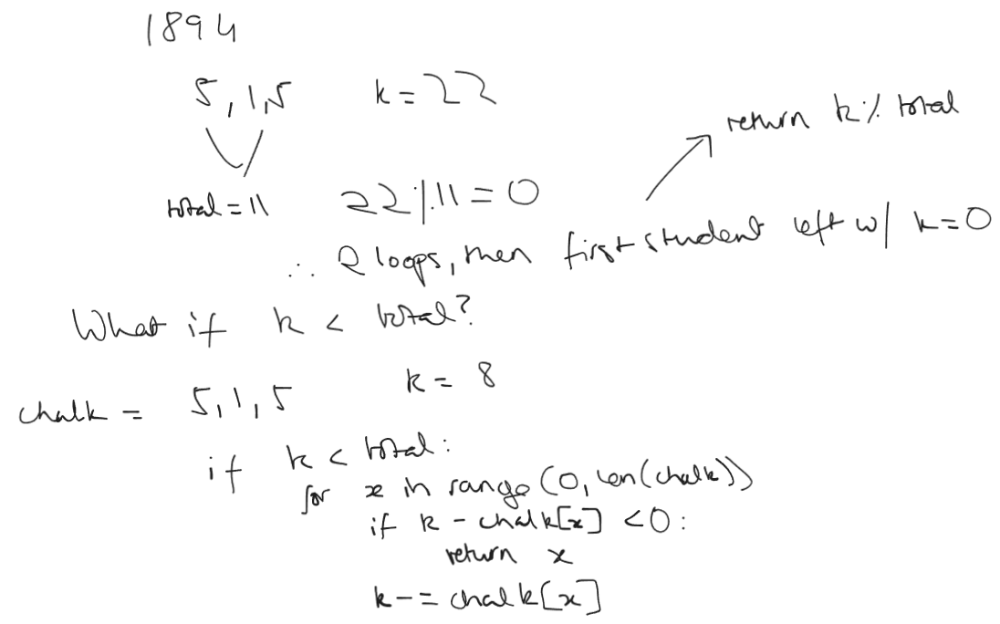
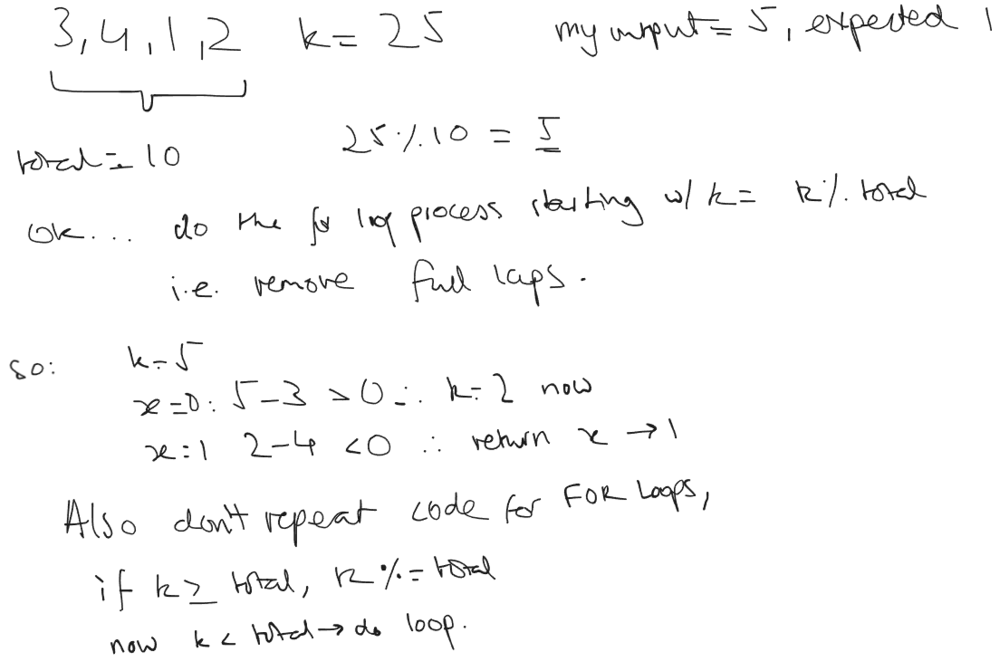

# 1894 Find the Student Replacing the Chalk

## Initial Thought Process:

Then, I realised that wouldn't work for the 2nd case, as the initial if statement only applied to case 1.
So, I altered the initial if statement to account for this.

I also minimised the code by ensuring that I didn't repeat code with 2 for loops that would have done the same thing.
